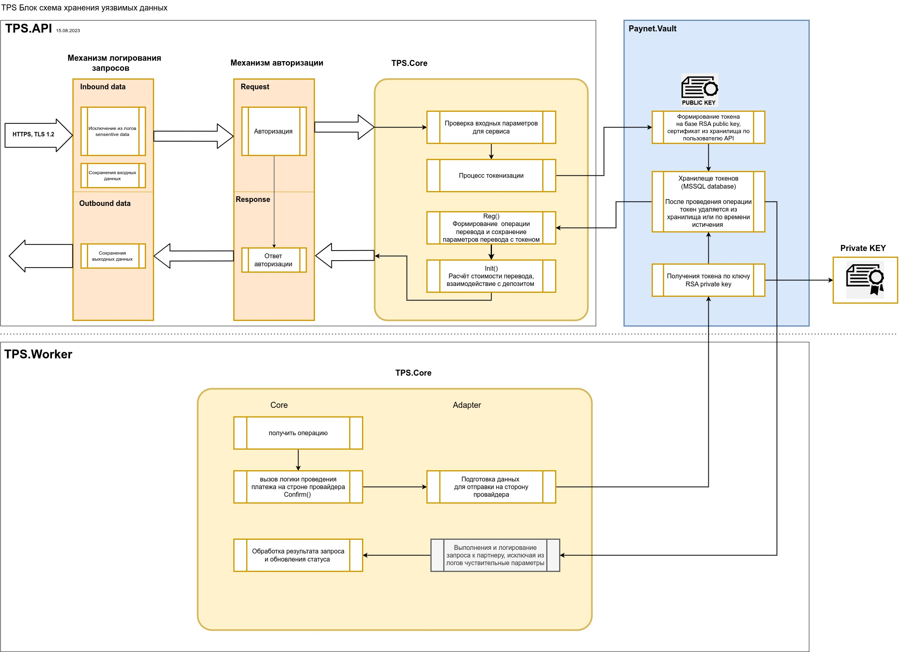

# 14. TPS Vault. Логика хранения уязвимых данных.

## Цель: 

Разработать механизм для обработки уязвимых параметров согласно правилам PCI DSS . Данный механизм должен обеспечить безопасное оперирования уязвимыми данными. Логика хранения должна быть построена по принципу разделения ответственности и доступ к данным.

## Реализация:

 

## Процесс обработки перевода разбит на два процесса: 

**1. Регистрация  перевода в системе**  
Все запросы в систему TPS логируются согласно внутренним регламентам, исключая чувствительные данные, это исключает их хранения во внутреннем хранилище логов. 
Далее данные проверяются и чувствительные данные сохраняются в  блоке PPVault (хранилище ) . Чувствительные параметры в   PPVault    криптуются  по RSA публичным ключом и в ответ получаем   токен , который меняются на  уязвимые данные.
 Пример:   PAN: 5102180061819559   =>  PAN: pp_token_test_34583423423423423. 
 
Далее в процессе используются только токены и маскированные данные параметров.  
**Пример:** PAN: 510218ХХХХХХ9559

**2. Обработка перевода в системе**  
	После успешной  регистрации перевода и проверки всех внутренних проверок AML, запускается финальный процесс перевода. Это отправка данных на сторону провайдера (A2C  Ukrcard ). При оправки формируется блок данных для вызова метода на стороне провайдера, данные взаимодействия по запросам с провайдером логируются кроме всех чувствительных параметров. На данном этапе токены заменяются на реальные данные. Данные запрашиваются из блока  PPVault по их токену. В нутри блока  PPVault  происходит поиск и дикриптация данных на основе приватного ключа из системного хранилища сертификатов для данного пользователя, под которым запущено программное обеспечение.

**Заключение:**  
	Таким образом на протяжение всего процесса,  чувствительные параметры не встречаются в открытом виде и доступ к ним происходит по средствам  PPVault, который отвечает за сохранения данных. Так же предусмотрена, что криптованые параметры из блока  PPVault  будут удалены  при истечении времени или по принуждению, к примеру при успешной или не успешном результате.